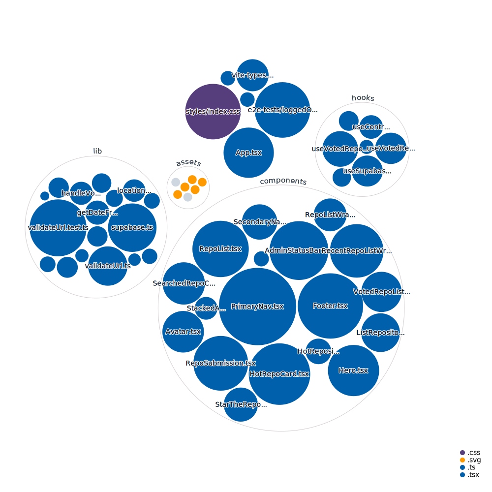

<div align="center">
  <br>
  
  <h1>🍕 hot.opensauced.pizza 🍕</h1>
  <strong>The site that recommends the hottest sauce. Inspired by <a href="https://daily.dev/">daily.dev</a></strong>
</div>
<br>
<p align="center">
  <a href="https://github.com/open-sauced/hot/actions/workflows/release.yml">
    
  </a>
  <a href="https://github.com/open-sauced/hot/actions/workflows/compliance.yml">
    
  </a>
  <a href="https://github.com/open-sauced/hot/actions/workflows/codeql-analysis.yml">
    
  </a>
  
  
  
  <a href="https://github.com/open-sauced/hot/issues">
    
  </a>
  <a href="https://github.com/open-sauced/hot/releases">
    
  </a>
  <a href="https://discord.gg/U2peSNf23P">
    
  </a>
  <a href="https://twitter.com/saucedopen">
    
  </a>
</p>

## Prerequisites

In order to run the project we need the following software binaries installed on our development machines:

- `node>=16.7.0`
- `npm>=8.0.0`

We can also use one of the listed cloud providers we support:

## 🖥️ Local development

To install the application:

```shell
npm ci
```

To start a local copy of the app on port `3000`:

```shell
npm start
```

### 🧪 Test

For running the test suite, use the following command. Since the tests run in watch mode by default, some users may encounter errors about too many files being open. In this case, it may be beneficial to [install watchman](https://facebook.github.io/watchman/docs/install.html).

```shell
npm test
```

You can request a coverage report by running the following command:

```shell
npm run test:coverage
```

For writing tests, the rule is move business or service logic to the lib folder and write unit tests. Logic that needs to be in a React component, then leverage tools like [Cypress](https://www.cypress.io/) or [Vitest mocking](https://vitest.dev/guide/mocking.html) to write tests.

### 📦 Docker builds

A development preview can also be run from docker:

```shell
docker build -t open-sauced-hot .
docker run -p 8080:80 open-sauced-hot
```

Alternatively you can pull the production container and skip all builds:

```shell
docker run -dit -p 8080:80 ghcr.io/open-sauced/hot
```

### 🎨 Code linting

To check the code and styles quality, use the following command:

```shell
npm run lint
```

This will also display during development, but not break on errors.

To fix the linting errors, use the following command:

```shell
npm run format
```

It is advised to run this command before committing or opening a pull request.

### 📕 Types

We have a couple of scripts to check and adjust missing types.

In order to dry run what types would be added to `package.json`:

```shell
npm run types:auto-check
```

In order to add any missing types to `package.json`:

```shell
npm run types:auto-add
```

### 🚀 Production deployment

A production deployment is a complete build of the project, including the build of the static assets.

```shell
npm run build
```

## 🤝 Contributing

We encourage you to contribute to Open Sauced! Please check out the [Contributing guide](https://docs.opensauced.pizza/contributing/introduction-to-contributing/) for guidelines about how to proceed.

We have a commit utility called [@open-sauced/conventional-commit](https://github.com/open-sauced/conventional-commit) that helps you write your commits in a way that is easy to understand and process by others.

It is generally integrated as an `npm` script but you can run it with `npx` as well:

```shell
npm run push
```

For any other npm based project or dotnpmrc defaulting to `--yes`:

```shell
npx -y @open-sauced/conventional-commit
```

## 🍕 Community

Got Questions? Join the conversation in our [Discord](https://discord.gg/U2peSNf23P).  
Find Open Sauced videos and release overviews on our [YouTube Channel](https://www.youtube.com/channel/UCklWxKrTti61ZCROE1e5-MQ).

## 🎦 Repository Visualization

[
](./src)

## ⚖️ LICENSE

MIT © [Open Sauced](LICENSE)
