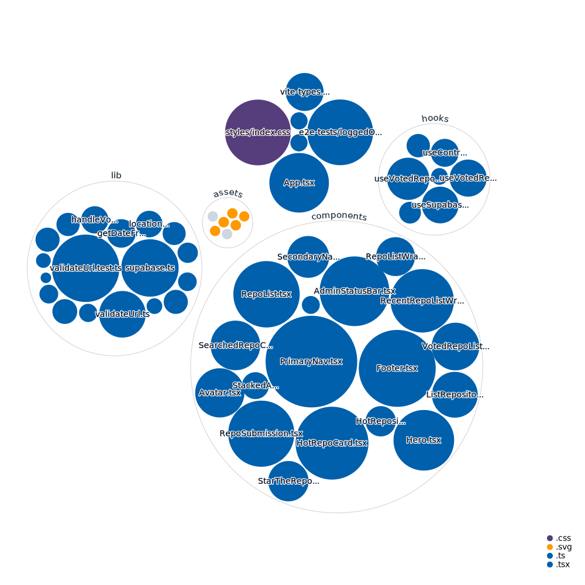

[](https://hot.opensauced.pizza)

# 🍕 Hot Sauce 🍕

> The site that recommends the hottest sauce

[](https://github.com/open-sauced/hot-sauce/actions/workflows/release.yml)
[](https://github.com/open-sauced/hot-sauce/actions/workflows/compliance.yml)
[](https://github.com/open-sauced/hot-sauce/actions/workflows/codeql-analysis.yml)
[](https://github.com/open-sauced/hot-sauce/actions/workflows/release.yml)

## 🤝 Contributing

[](https://stackblitz.com/github/open-sauced/hot-sauce)

We encourage you to contribute to Open Sauced! Please check out the [Contributing guide](https://docs.opensauced.pizza/contributing/introduction-to-contributing/) for guidelines about how to proceed.


### 📖 Prerequisites

In order to run the project from a container we need `node>=14`, `npm>=7` and `docker>=20` installed on our development machines.

### 🖥️ Local development

```sh
npm ci
npm start
```

## 🍕 Community

Got Questions? Join the conversation in our [Discord](https://discord.gg/U2peSNf23P).  
Find Open Sauced videos and release overviews on our [YouTube Channel](https://www.youtube.com/channel/UCklWxKrTti61ZCROE1e5-MQ).

## 🎦 Repository Visualization

[
](./src)

## ⚖️ LICENSE

MIT © [Open Sauced](LICENSE)


